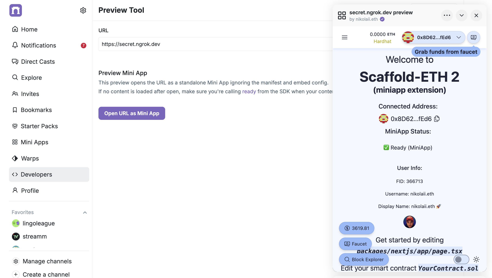

# Farcaster MiniApp Extension for SE-2

This extension provides basic functionality to start a Farcaster MiniApp development with [Scaffold-ETH 2](https://scaffoldeth.io)


## Installation

1. Create a new project with MiniApp extension:

```typescript
npx create-eth@latest -e NikolaiL/miniapp-extension
```


2. Copy packages/nextjs/.env.example to packages/nextjs/.env


3. After doing 

```typescript
yarn chain
yarn deploy
yarn start
yarn ponder:dev
```

start ngrok (or other) externally available tunnel

```typescript
ngrok http http://localhost:3000 --url https://yoursubdomian.ngrok.dev
```

4. Update NEXT_PUBLIC_URL in packages/nextjs/.env for your domain

5. Go to https://farcaster.xyz/~/developers/mini-apps/preview , enter your app domain and click "Open URL as Mini App"


Your miniapp should load and show your Farcaster Wallet.




Renders as MiniApp in Farcaster Preview:


Base App preview:


And as a cast:


TODO:

- [x] added ponder 0.14.1  
- [ ] add live query example
- [ ] add MiniApp Demo Page with all available functions
- [ ] add readme section about ponder
- [ ] add manifest accountAssociation values generation

